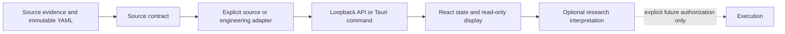

# PFR-V2B-R6-N1 Research To Execution Influence Graph

## Scope and method

This graph is derived from the current code paths in `sbc/`,
`gann-astro-desk/backend/`, `gann-astro-desk/src/`, and
`gann-astro-desk/src-tauri/`. It is an audit record, not a new product
contract. A source record is not an authorization to calculate a score,
display direction, forecast price, or execute an order.

The final dashed edge has no implemented authorized route. The Tauri runtime,
backend APIs, companion session, source profiles and range responses all carry
`executionAllowed: false` and the frontend now rejects a missing lock as well
as a true value.

## Active paths and gates

| Owner / source | Loader and adapter | Output route | Unknown / partial behavior | Authorization and isolation gate | Evidence |
| --- | --- | --- | --- | --- | --- |
| BPHS 1899 calendar | `bphs_classical_timing_service.py` | BPHS pane in Fields | TARA remains `DEPENDENCY_NOT_READY`; civil weekday remains partial | Calendar is source/engineering timing only, no polarity consumer | BPHS source and backend tests |
| Phaladeepika editor profile | grid + `VedhaGuidanceEngine` | Chakra / existing independent SBC range | profile-defined partial status remains visible | Explicit selected profile only | grid / guidance tests |
| Trailokya TD1/TD2/TD3 | `configs/sbc/trailokya/*.yaml` | source audit only; Fields SBC range returns `GEOMETRY_ONLY_RANGE_NOT_IMPLEMENTED` | no score, no wave and source gaps are returned | runtime promotion false; direct geometry now rejects legacy-grid borrowing | Trailokya source tests |
| Agarwal 2000 | read-only Agarwal adapter | Chakra source inspector | operator remains `DEPENDENCY_NOT_READY` | `executionAllowed=false`, source data is static and no Fields input exists | Agarwal fixtures/UI tests |
| USD / JPY chart identities | canonical chart registry -> transit event range compiler | independent side fields | unreviewed event segments are `UNKNOWN` | accepted chart IDs and exact event identity validation | event compiler / range tests |
| Pair-relative field | `pairRelativeField.ts` | Fields pair pane | either unknown side yields `UNKNOWN_SIDE_EVIDENCE` and a null display value | explicit FX base minus quote only; SBC is not an input | pair field unit tests |
| SBC availability | synchronized range service | independent SBC pane | Trailokya uses explicit geometry-only unavailable state | no fusion with USD, JPY or pair | synchronized range tests |
| Auto Suggest / local research | separate review and local-only paths | no current TD1/TD2/TD3 input path | source records have prohibited-use lists | automatic use remains disabled | source contracts and guardrails |
| MT5 / execution | `mt5_gateway.py`, Tauri runtime | diagnostics/data only | failure is surfaced as status/error | execution lock required false end-to-end | runtime/companion guard tests |

## Edge rules

1. Every source YAML record has an owner source ID, source status, explicit
   prohibited uses, and `executionAllowed: false` when it is source-only.
2. The backend only emits the selected synchronous field contract. The
   frontend does not provide production side-event payloads; the backend
   compiler owns accepted chart identity and event construction.
3. Pair compilation uses unioned canonical UTC boundaries and never samples,
   interpolates, or replaces a missing side with zero.
4. A regular score/guidance profile is never substituted for Trailokya
   source-only range availability. The direct geometry route now additionally
   refuses the legacy generic grid until a distinct source-native grid adapter
   exists.
5. No source profile may supply another profile's missing target, strength,
   ray, numerical modifier, or polarity. Historical cross references are
   evidence only, not runtime inheritance.

## Numerical-layer boundary matrix

| Numeric system | Unit and semantics | Authorized consumer | Prohibited consumers |
| --- | --- | --- | --- |
| TD2 sthana phala | source phala parts 20/15/10/5 and inverse | source audit only | Arghya Viswa, Fields, score, polarity, price |
| TD2 verse-166 | isolated x2/x3/x0.5 source modifiers | source audit only | composed multiplier, score, market signal |
| TD3 Viswa/Vimsopaka | Arghya-specific five-class and proportional units | locked Arghya evidence lab | universal SBC reducer, Fields, price/FX |
| TD3 twenty-part Arghya | historical commodity basis | locked source record | price forecast, FX mapping |
| Agarwal strength | source-record pages 54-55/60-63 | Agarwal inspector | aggregate score, Fields, pair |
| Phaladeepika guidance | existing profile-specific engineering guidance | selected existing profile only | Trailokya replacement |
| Side balance | normalized active reviewed categorical components | independent USD or JPY pane | SBC confirmation, source doctrine |
| Pair-relative display | `(USD balance - JPY balance) / 2`, clamped | explicit USDJPY research pane | stocks, SBC, execution |
| SBC range | profile-specific availability/state | independent SBC pane | USDJPY pair calculation |
| ML/research features | local review metadata | separate research workflows only | source-contract runtime promotion |

## Known intentional gaps

- Trailokya does not yet have a source-native grid adapter usable by the
  existing `CompiledGrid` implementation. The previous implicit generic-grid
  use is now prohibited rather than approximated.
- TD3 remains a source/financial-hypothesis record. A full Arghya worked
  calculation and modern instrument mapping are not authorized.
- No profile has a route to execution. `SOURCE_CLOSED != RUNTIME_AUTHORIZED`.
