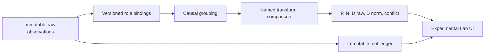

# PFR-V2B-R7-XE1 Architecture

## Contract

`XE1_EXPERIMENTAL_EVIDENCE_LAB_V1` is a read-only experimental platform. It
uses immutable raw observations, versioned role bindings, causal grouping,
bounded modifier transforms, a categorical state vector, and a trial ledger.

## Typed Evidence

Each `EvidenceObservationV1` keeps an observation ID, event ID, optional causal
ID, timestamp, source profile ID, feature key, typed raw value, unit, source
semantic, status, provenance, and explicit unknown reasons. Supported types are
`SCALAR`, `SIGNED_SCALAR`, `CATEGORY`, `BOOLEAN_GATE`, `TUPLE_SET`, `INTERVAL`,
and `UNKNOWN`.

Changing a role or transform recompiles a new derived snapshot; it never edits
the raw fixture.

## Causal Contract

- `UNIQUE`: one possible directional contribution.
- `SHARED_CAUSE`: one group contribution maximum.
- `DERIVED_CHILD`: audit-only; never an independent vote.
- `AMBIGUOUS`: excluded from aggregate direction with an explicit fail-closed status.

## Modifier Contract

The primary transform is `M(z; beta) = clip(exp(beta * z), mMin, mMax)`.

It has finite bounds, `mMin >= 0`, and `beta = 0` gives `1`. The positive
multiplier cannot flip a sign. Unknown modifier input remains unknown; it is
not converted to zero. Separate-channel and interaction transforms are shown
only as named comparisons.

## State Vector

For active group values `x`: `P = sum(max(x, 0))`, `N = sum(max(-x, 0))`,
`D raw = P - N`, `Activity = P + N`, and `D norm = (P - N) / (P + N)` only
when activity is positive. No activity produces `UNKNOWN_NO_ACTIVE_EVIDENCE`,
not neutral or zero.

Confidence is displayed separately and never multiplies directional evidence by default.

## Locks

All XE1 API responses carry `executionAllowed: false`. XE1 reads neither price
nor price outcomes and does not read SBC, Fields, Auto Suggest, ML, MT5, or an
execution path.
