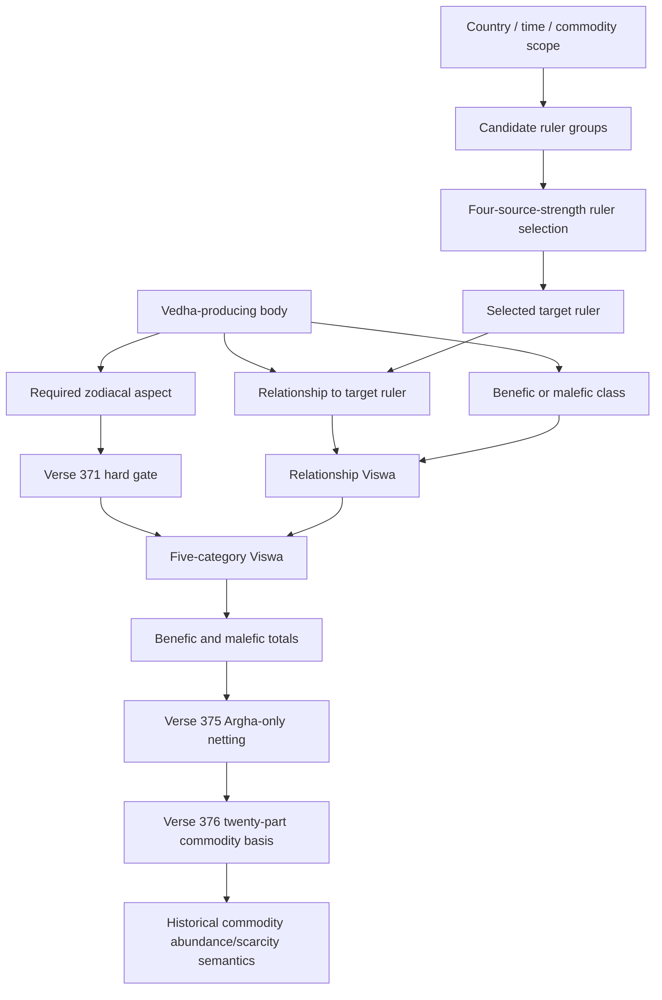

# TD3R Argha Dependency Graph

Status: source reconstruction only. This graph neither creates a market model nor authorizes runtime behavior.

| Edge or stage | TD3R state | Evidence / reason |
| --- | --- | --- |
| Scope to candidate groups | SOURCE-CLOSED | Verses 345-354, printed pp.76-78. |
| Candidate groups to selected ruler | NOT-YET-REPRODUCIBLE | The four strength dimensions are named, but their aggregation, tie and precedence rule is not source-closed. |
| Kshetra, Vakra, Udaya, Uccha components | PARTIAL | Their qualitative/proportional forms are recorded at verses 358-361, but timestamp and longitude-provider contracts are incomplete. |
| Vedha to relationship/aspect inputs | PARTIAL | TD1/TN1 provides bounded source records; complete traversal, simultaneous-hit precedence and universal validity remain unclosed. |
| Required aspect to Viswa | SOURCE-CLOSED HARD GATE | Verse 371: a geometric Vedha without the required zodiacal aspect produces no Argha result. |
| Relationship/aspect to literal Viswa tables | SOURCE-CLOSED | Corrected 1972 printed pp.82-83, 2016 reading witness agrees. |
| Five-category Viswa | SOURCE-CLOSED LITERAL TABLE | Corrected 1972 printed p.85, with two preserved literal anomalies. |
| Totals to residual | SOURCE-CLOSED, ARHGA-SCOPED | Verse 375 supports netting only within Argha. It is not a universal SBC reducer. |
| Residual to twenty-part basis | SOURCE-CLOSED FOR COMMODITY BASIS | Verse 376 makes `20 + residual` a historical commodity-basis quantity, not a return or price equation. |
| Commodity basis to modern price / FX | BLOCKED | Bhava/mulya distinction, missing full worked calculation, and no modern ontology/mapping authorization. |

The TD3R low-level component module intentionally ends at the closed table, netting and commodity-basis stages. It returns `UNKNOWN` whenever an upstream requirement is missing; it cannot select a ruler or create a source result end-to-end.
