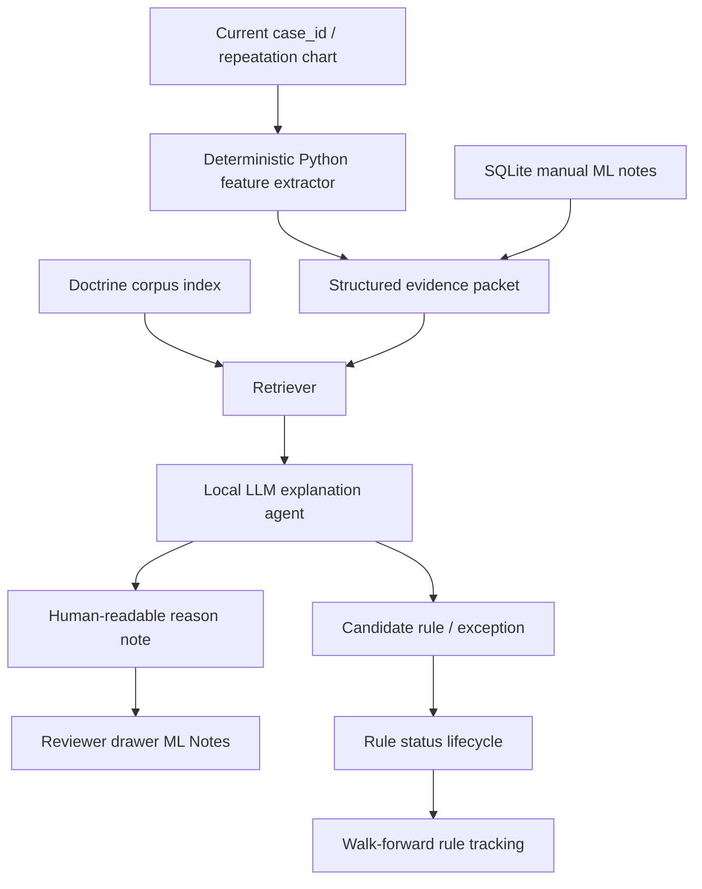

# Local Jyotish Agent Plan

Last updated: 2026-07-11 IST

## Purpose

Build a local Jyotish explanation agent for the USDJPY Gann / financial astrology research workspace.

The agent should explain why a repeated aspect case may behave bullish, bearish, mixed, or unclear by combining:

- deterministic chart features already produced by Python,
- manually reviewed marker/rule notes,
- retrieved doctrine text from local PDFs and public/open classical sources,
- walk-forward evidence from the case-family database.

The agent must not calculate ephemeris, trade entries, Shadbala, SR geometry, Gann fans, or final trading signals by itself. Those remain deterministic Python/script responsibilities.

## Guardrails

1. Deterministic code owns calculations.
   - Swiss Ephemeris, ayanamsa, panchanga, Shadbala, Drik Bala, SR geometry, marker placement, and P/L are script outputs.
   - The LLM can explain script outputs and compare them with doctrine citations.

2. LLM output is evidence-ranked, not oracle-ranked.
   - It must state whether a claim came from a scripture/source, a manual ML note, or observed walk-forward statistics.
   - It should separate `doctrine says`, `case-family evidence says`, and `this chart visually suggests`.

3. Source rights stay clean.
   - User-owned PDFs and workspace-generated notes can be indexed locally.
   - Public-domain candidates can be ingested after metadata review.
   - Modern translations found online stay retrieval-only unless user owns them or the license is clearly permissive.

4. No hallucinated citations.
   - If a page/section is missing, the agent should say `citation missing`.
   - Every doctrine rule used for ML should eventually carry source id, section/page, and confidence.

## Source Authority Hierarchy

Retrieval must preserve source type instead of blending all books and notes into one voice:

1. `root_classical_text`: identified edition/translation of a classical source, with page or verse locator.
2. `secondary_interpretive_commentary`: modern authors such as Sanjay Rath or B. V. Raman; useful for synthesis and source discovery, but not a doctrine lock by itself.
3. `experimental_authored_method`: Padmanabhan, Krushna KAS and other testable modern systems; quarantined until independently reproduced and validated.
4. `workspace_empirical_evidence`: reviewed cases, rule lessons and walk-forward statistics; this may calibrate market behavior but is not scripture.
5. `local_llm_draft`: explanation only, always untrusted until deterministic verification and Codex/human review.

If sources disagree, the agent must show the disagreement and its provenance. The ranked acquisition plan is maintained in `classical_jyotish_corpus_canon_20260711.md`.

## Recommended Architecture

## Evidence Packet Per Case

For each reviewed repeatation, store these fields before asking the local LLM:

- case identity: `case_id`, `family_key`, aspect, pair key, timeframe.
- market result: entry/exit, direction, signed pips, rule-vs-default delta.
- SR geometry: support/resistance relation, epsilon, distance in pips, break/retest/continuation status.
- attribution boundary: next hardcoded marker time, pair/aspect, whether exit was capped.
- Gann geometry: anchor candle time, anchor wick price, fan scale, touched fan lines if any.
- Shadbala: total, ratio, component strengths, missing/approximation status.
- Drik Bala: benefic/malefic pressure and signed total.
- Sthana/dignity: sign, sign lord, friend/enemy/own/exalt/debilitated labels.
- house context: whole-sign house and simplified house group.
- panchanga: weekday/lord, tithi, paksha, nakshatra, pada, yoga, karana, change flags.
- overlap cleanliness: active regime count, nearby events, ignore markers and notes.
- manual notes: trade notes, ignore notes, family rules, ML case notes.

## Local Agent Roles

### 1. Doctrine Retriever

Input: structured evidence packet.

Output: short source snippets or references only for relevant features:

- Shadbala component meaning,
- benefic/malefic pressure,
- Moon condition,
- Jupiter/Saturn/Mars natural support/pressure roles,
- panchanga timing clues,
- house/sign dignity,
- aspect/contact doctrine.

### 2. Case Explainer

Input: evidence packet plus retrieved sources.

Output:

- plain-English explanation,
- key reasons for bullish/bearish behavior,
- reasons for failure/mixed behavior,
- whether the result depends more on doctrine, SR geometry, or family statistics.

### 3. Rule Drafting Assistant

Input: repeated manual notes and rule outcome tracking.

Output:

- local case-family rule candidate,
- universal rule candidate,
- exception candidate,
- features to log for ML,
- status recommendation: provisional, accepted, revise, discard.

### 4. Walk-Forward Critic

Input: rule performance table.

Output:

- whether rule improved P/L or overfit one repeatation,
- which conditions separate winners from losers,
- warning if evidence is too thin.

## First Corpus Priorities

1. User PDFs:
   - `Building a Strict Vedic Astrology Prediction Engine with a Local LLM Layer.pdf`
   - `jyotish_best-way-to-use-shad-bala_k-jaya-sekhar.pdf`

2. Workspace-generated notes:
   - `gann_aspect_annotations.sqlite`
   - `CURRENT_PROJECT_HANDOFF.md`
   - `vedic_pdf_alignment_review_20260520.md`
   - `astro_function_research_audit_20260521.md`

3. Classical/public-domain candidates:
   - Surya Siddhanta
   - Vedanga Jyotisha
   - Brihat Jataka
   - Brihat Samhita
   - older translations of BPHS, Saravali, Phaladeepika, Hora Sara if metadata/license is acceptable.

## Near-Term Build Steps

1. Create a corpus downloader/registrar that only downloads or registers allowed sources.
2. Extract text to `jyotish_agent/corpus_text/` with page markers when possible.
3. Chunk text by source, page, and topic.
4. Build a local vector index.
5. Add a command:
   `python jyotish_agent/explain_case.py --case-id 43`
6. Output:
   - `explanation.md`
   - `candidate_rule_note.txt`
   - `missing_citations.md`
7. Add a reviewer button later:
   `Draft ML Reason`

## Immediate Open Questions For Later

- Which local LLM runtime do you prefer: Ollama, LM Studio, llama.cpp, or OpenAI-compatible local server?
- Which embedding model should we use locally?
- Should the local agent answer only in English, or English plus Sanskrit/Hindi terms?
- Should copyrighted/user-owned PDFs be indexed only on your machine and never committed?

## Current Decision

Start with RAG and explanation, not model fine-tuning. Fine-tuning may come later only on your own structured notes, rules, and feature/outcome pairs. This keeps the astrology doctrine traceable and prevents the model from turning into a confident-but-uncited black box.
